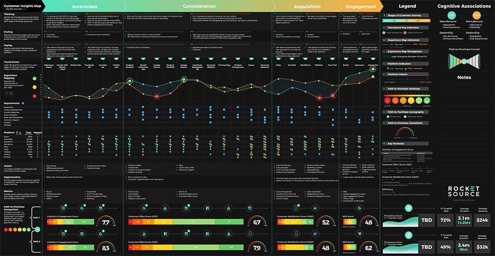
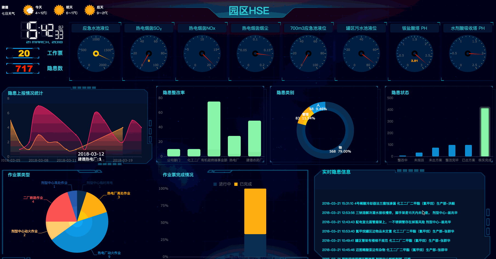
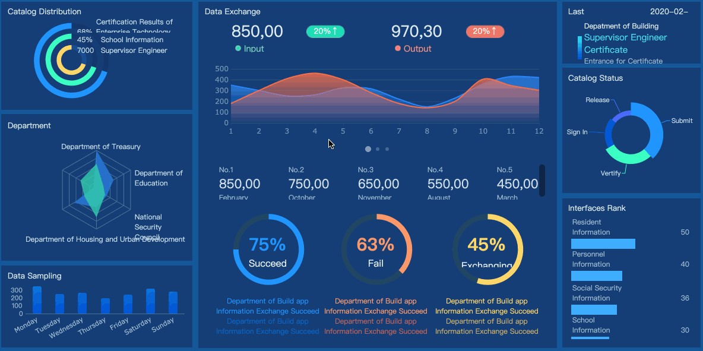

# Max - Q    
Research and Development of advanced machine-learning algorithms and models implemented
in an artificial neural-network and virtual environment.  As a form of Time-Series execution.

  

  

  

  

  

Interactive dashboards are for demonstration and display only! They are not the dashboards.

Repository is a (Wip) and under construction...wait for the Public Release to clone and run properly. 
